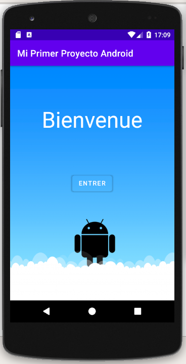

# Mi primer proyecto Android

Esta aplicación en Android está enfocada en el diseño de una única actividad principal. La aplicación soporta orientación horizontal y vértical, así como 4 idiomas: español, inglés, francés y alemán. Además, usando <a href="https://developer.android.com/studio/write/draw9patch?hl=es-419">9 patch</a> la aplicación soporta los tamaños de pantalla mdpi, hdpi, xhdpi, xxhdpi y xxxhdpi. A continuación se ilustra el soporte a múltiples idiomas, en una dispositivo con pantalla de tamaño xxhdpi:

El soporte a la orientación horizontal:

Y un ejemplo de soporte a otro tamaño de pantalla, con un dispositivo con pantalla de tamaño mdpi:

Este proyecto fue realizado como parte del curso <a href="https://www.coursera.org/learn/fundamentos">Fundamentos de Android</a>.

